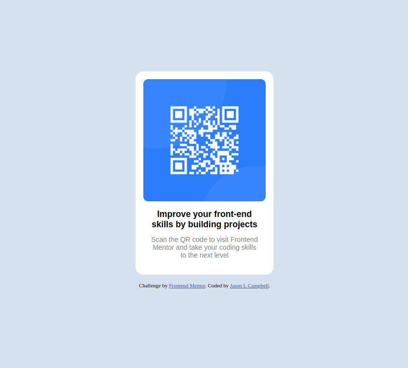
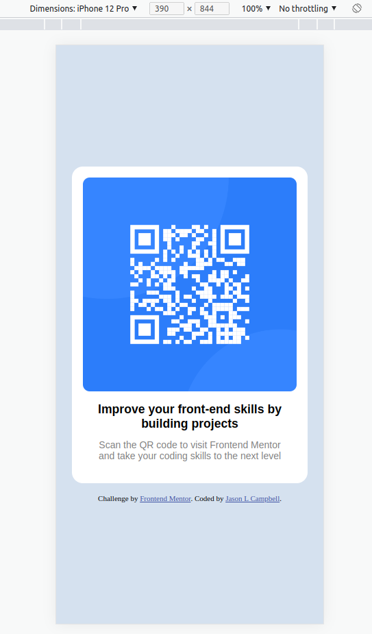

# Frontend Mentor - QR code component solution

This is a solution to the [QR code component challenge on Frontend Mentor](https://www.frontendmentor.io/challenges/qr-code-component-iux_sIO_H). Frontend Mentor challenges help you improve your coding skills by building realistic projects. 

## Table of contents

- [Overview](#overview)
  - [Screenshot](#screenshot)
  - [Links](#links)
- [My process](#my-process)
  - [Built with](#built-with)
  - [What I learned](#what-i-learned)
  - [Continued development](#continued-development)
  - [Useful resources](#useful-resources)
- [Author](#author)
- [Acknowledgments](#acknowledgments)

**Note: Delete this note and update the table of contents based on what sections you keep.**

## Overview

### Screenshot

### Links

- Solution URL: [https://github.com/jcampbell18/qr-code-component-main](https://github.com/jcampbell18/qr-code-component-main)
- Live Site URL: [https://jcampbell18.github.io/qr-code-component-main/](https://jcampbell18.github.io/qr-code-component-main/)

## My process
 
1. Create Style Guide (e.g., font sizes, colors, widths, margin, padding, etc.)
2. Determine the containers needed, and write out a rough idea in HTML (start with divs)
3. Refactor HTML into semanticly correct elements
4. Give classes to the elements, and reflect in CSS
5. Write out CSS, and add breakpoint for mobile view
6. Refactored CSS with DRY (Don't Repeat Yourself)
7. Received feedback after submitting solution - made changes from the recomendations
8. [Validated HTML](https://validator.w3.org/)

### Built with

- Semantic HTML5 markup
- CSS custom properties
- Flexbox

### What I learned

Since this is my first challenge, it wasn't learning persay, but re-familiarizing myself with aspects of HTML, and CSS (e.g., Flexbox)

### Continued development

I just want to tighten down my skills, and keep on track with responsive web design/development

### Useful resources

- [MDN: CSS](https://developer.mozilla.org/en-US/docs/Web/CSS) - Used this site to help with condensing down `font` in CSS.
- [CSS-Tricks: Flexbox](https://css-tricks.com/snippets/css/a-guide-to-flexbox/) - This is my goto site for any questions that I have for Flexbox.

## Author

- Website - [Jason L Campbell](https://jasonlcampbell.com)
- Frontend Mentor - [@jcampbell18](https://www.frontendmentor.io/profile/jcampbell18)
- Twitter - [@jcryuu](https://www.twitter.com/jcryuu)
- LinkedIn - [jcampbell18](https://www.linkedin.com/in/jcampbell18)

## Acknowledgments

Just a big shoutout to FrontendMentor for creating these challenges and helping us coders out here, improve ourselves!